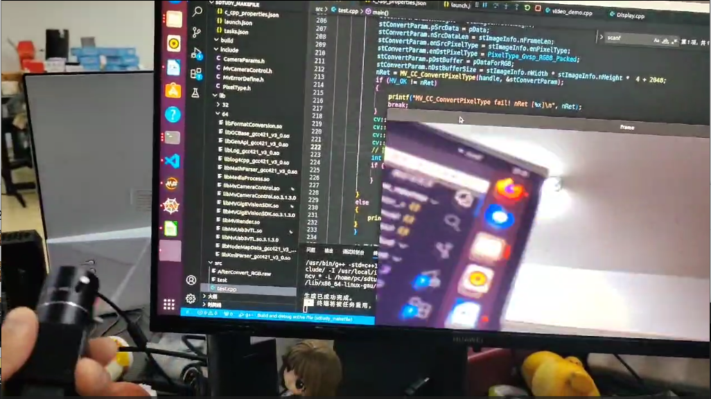

# Hikvision海康工业相机

## 一、环境介绍

**基础环境**

|   Name   |       Parameter       |
| :------: | :-------------------: |
| 操作系统 |  Ubuntu20.04 x86_64   |
| 工业相机 | 海康威视MV-CA016-10UC |
|  OpenCV  |         4.7.0         |
|   GCC    |         9.4.0         |

**项目目录**

|   Name    |                          Parameter                           |
| :-------: | :----------------------------------------------------------: |
| ~~infer~~ | ~~存放工业相机的驱动包1475450208MVS_V2.0.0_200720(Linux X86)~~ |

## 二、基础配置

​		使用VScode作为IDE，需要配置**c_cpp_properties.json**、**tasks.json**、**launch.json**，项目里面已经存放，更改相关的项目路径即可。前提是已经安装好以上的环境，VScode需要安装好C/C++的插件。~~至于OpenCV的坑，我只能说加油O.o?~~

### 2.1   c_cpp_properties.json

```json
{
    "configurations": [
        {
            "name": "Linux",
            "includePath": [
                "${workspaceFolder}/**",
                "/usr/local/include/opencv4" /* 更换为自己的OpenCV安装路径*/
            ],
            "defines": [],
            "compilerPath": "/usr/bin/gcc",
            "cStandard": "c17",
            "cppStandard": "gnu++14",
            "intelliSenseMode": "linux-gcc-x64"
        }
    ],
    "version": 4
}
```

### 2.2   tasks.json

​		除了海康Vision的lib库需要更换为自己的路径之外，OpenCV如果默认安装在**/usr/local/**就不需要更换，X11的lib库加进来的原因是因为一直无法正常的读取x11和pthread的的动态链接库，

```json
{
    "tasks": [
        {
            "type": "cppbuild",
            "label": "C/C++: g++ build active file",  /* 与launch.json文件里的preLaunchTask的内容保持一致 */
            "command": "/usr/bin/g++",
            "args": [
                "-std=c++11",
                "-g",
                //"${file}",   /* 编译单个文件 */
                "${fileDirname}/*.cpp",  /* 编译多个文件 */
                "-o",
                "${fileDirname}/${fileBasenameNoExtension}",  /* 输出文件路径 */
 
                /* 项目所需的头文件路径 */
                "-I","${workspaceFolder}/",
                "-I","/usr/local/include/",
                "-I","/usr/local/include/opencv4/",
                "-I","/usr/local/opencv4/opencv2",
 
                /* 项目所需的库文件路径 */
                "-L", "/usr/local/lib/",
                "-I", "/home/pc/sdtudy_makefile/include",

                /* OpenCV的lib库 */
                "/usr/local/lib/libopencv_*",

                /* 海康Vision的lib库 */
                "-L","/home/[your_hostname]/[yourpath]/lib/64", /* [your_hostname]更换为自己的主机名 [yourpath]更换为自己的路径*/
                "/home/[your_hostname]/[yourpath]/lib/64/*", 

                /* X11的lib库 */
                "-L","/usr/lib/x86_64-linux-gnu",
                "/usr/lib/x86_64-linux-gnu/libX11.so",
                "/usr/lib/x86_64-linux-gnu/libpthread.so",
            ],
            "options": {
                "cwd": "${fileDirname}"
            },
            "problemMatcher": [
                "$gcc"
            ],
            "group": {
                "kind": "build",
                "isDefault": true
            },
            "detail": "Task generated by Debugger."
        }
    ],
    "version": "2.0.0"
}

```

### 2.3   launch.json

```json
{

    "version": "0.2.0",
    "configurations": [
        {
            "name": "g++ - Build and debug active file",
            "type": "cppdbg",
            "request": "launch",
            "program": "${fileDirname}/${fileBasenameNoExtension}",  //程序文件路径
            "args": [],  //程序运行需传入的参数
            "stopAtEntry": false,
            "cwd": "${fileDirname}",
            "environment": [],
            "externalConsole": true,   //运行时是否显示控制台窗口
            "MIMode": "gdb",
            "setupCommands": [
                {
                    "description": "Enable pretty-printing for gdb",
                    "text": "-enable-pretty-printing",
                    "ignoreFailures": true
                }
            ],
            "preLaunchTask": "C/C++: g++ build active file",
            "miDebuggerPath": "/usr/bin/gdb"
        }
    ]
}

```

## 三、核心代码讲解

​		工业相机采集图像需要经过**查找设备、创建句柄、开启设备、开启取流、关闭取流、关闭设备、销毁句柄**七个流程，我们使用OpenCV采集图像也主要是在取流的过程中采集。此例程为test.cpp，是根据ImageProcess.cpp 例程修改的，原始例程在安装相机驱动之后存放在Samples里面的，自行查看，以下的讲解也是以注释为主，仔细阅读代码逻辑。

```c++
// 开始取流
// start grab image
nRet = MV_CC_StartGrabbing(handle);
if (MV_OK != nRet)
{
    printf("MV_CC_StartGrabbing fail! nRet [%x]\n", nRet);
    break;
}
MV_FRAME_OUT_INFO_EX stImageInfo = {0};
memset(&stImageInfo, 0, sizeof(MV_FRAME_OUT_INFO_EX));
pData = (unsigned char *)malloc(sizeof(unsigned char) * stParam.nCurValue);
if (NULL == pData)
{
    break;
}

cv::Mat frame,image; // 创建Mat 
unsigned int nDataSize = stParam.nCurValue;
nRet = MV_CC_GetOneFrameTimeout(handle, pData, nDataSize, &stImageInfo, 1000);//这里为什么要事先取出一帧图像，要提供stImageInfo给pDataForRGB，所有先取出一帧图像，后面直接在循环里面连续取帧数据。
if (MV_OK != nRet)
{
    break;
}
pDataForRGB = (unsigned char*)malloc(stImageInfo.nWidth * stImageInfo.nHeight * 4 + 2048);//切勿放在循环里面，会内存泄露
if (NULL == pDataForRGB)
{
    break;
}
while(1){
	// MV_CC_GetOneFrameTimeout函数可以获取到原始图像的数据，该接口主动获取帧数据，较为平稳
    //切记所有的采集图像必须要先开启MV_CC_StartGrabbing取流  并且如果使用采用接口获取图像数据，就不要使用MV_CC_Display（有些接口应该可以使用，没试过） 
    nRet = MV_CC_GetOneFrameTimeout(handle, pData, nDataSize, &stImageInfo, 1000); 
    if (nRet == MV_OK)
    {
        //printf("Now you GetOneFrame, Width[%d], Height[%d], nFrameNum[%d]\n\n", 
        //stImageInfo.nWidth, stImageInfo.nHeight, stImageInfo.nFrameNum);
        // 像素格式转换
        // convert pixel format 
        MV_CC_PIXEL_CONVERT_PARAM stConvertParam = {0};
        // 从上到下依次是：图像宽，图像高，输入数据缓存，输入数据大小，源像素格式，
        // 目标像素格式，输出数据缓存，提供的输出缓冲区大小
        // Top to bottom are：image width, image height, input data buffer, input data size, source pixel format, 
        // destination pixel format, output data buffer, provided output buffer size
        stConvertParam.nWidth = stImageInfo.nWidth;
        stConvertParam.nHeight = stImageInfo.nHeight;
        stConvertParam.pSrcData = pData;
        stConvertParam.nSrcDataLen = stImageInfo.nFrameLen;
        stConvertParam.enSrcPixelType = stImageInfo.enPixelType;
        stConvertParam.enDstPixelType = PixelType_Gvsp_RGB8_Packed;
        stConvertParam.pDstBuffer = pDataForRGB;
        stConvertParam.nDstBufferSize = stImageInfo.nWidth * stImageInfo.nHeight *  4 + 2048;
        nRet = MV_CC_ConvertPixelType(handle, &stConvertParam);
        if (MV_OK != nRet)
        {
            printf("MV_CC_ConvertPixelType fail! nRet [%x]\n", nRet);
            break;
        }
        image = cv::Mat(cv::Size(stImageInfo.nWidth, stImageInfo.nHeight), CV_8UC3, pDataForRGB); // 将取出来的帧数据转化为Mat类型
        cv::cvtColor(image, frame, cv::COLOR_RGB2BGR); // 取出来的数据是RGB格式的，但OpenCV的显示是BGR，使用cvtColor转化图像数据格式
        cv::imshow("frame", frame);
        // 按下ESC键退出循环
        int keyCode = cv::waitKey(30);
        if (keyCode == 27) {
            break;
        }
        cv::destroyWindow;
        cv::destroyAllWindows;

    }
    else
    {
        printf("No data[%x]\n", nRet);
    }
}
// 停止取流
// end grab image
nRet = MV_CC_StopGrabbing(handle);
if (MV_OK != nRet)
{
    printf("MV_CC_StopGrabbing fail! nRet [%x]\n", nRet);
    break;
}


```

## 四、运行效果



## 五、参考资料 

**[Ubuntu 20.04源码编译安装OpenCV 4.7.0_/usr/bin/ld: /home/ubuntu/miniconda3/envs/torch_ts-CSDN博客](https://blog.csdn.net/weixin_43863869/article/details/128552342)**

**MachineVisionCamera SDK（C）DeveloperGuide_V3.1.0（海康相机驱动之后安装自带的开发手册）**